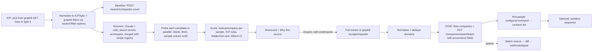

# Source Scout: Level 2 plan (Data Source Discovery)

graph8 Hackathon Lahore, 26–27 Sep 2026. Source: the official brief, `graph8.com/hackathon-brief/`, which **overrides the earlier tracks page**.

| | |
|---|---|
| Venue hours | **12:00–22:00 on both days** (exit at 22:00; no overnight at the venue) |
| Hacking | Sat 13:00 → Sun 17:30 **code freeze + submission** |
| Repo | **Public on GitHub (or shared with the graph8 org) by Sun 14:00** |
| Demo | Sun 18:00, **5 min per team, live and unrehearsed**; judging at 19:15 |
| Keys | Sandbox keys + credits are handed out **when you lock your idea on Saturday** |
| Interviews | Run all weekend alongside hacking, so how you work counts, not only the demo |

## ⚠️ Rule risk: "No spam, no scraping" (resolve before locking the idea)

The brief's rules say: **"No spam, no scraping. Fair use rate limits apply. Hammering the search API is not a project."** Source Scout reads public web pages, so **ask a graph8 engineer on the floor before you lock the idea.** Ask exactly this:
> "Our project finds public company lists (accelerator portfolios, exhibitor lists, open datasets), samples about 30 rows, and checks them against graph8 lookups. Is that OK if every page read goes through graph8's own `POST /scrape/requests` or comes from open datasets and APIs, with caching and no bulk crawling?"

- **If yes:** build the plan as written, with these limits:
  - All page reads go through `/scrape/requests` (graph8's scraper respects robots.txt) or through open JSON/CSV datasets.
  - Claude `web_search` is used only for *finding* sources.
  - Samples are ≤30 rows. Every lookup is cached. Coverage checks batch domains with `any_of` instead of looping calls.
  - No crawling beyond 3 pages per source.
- **If no, pivot to "Source Scout for lists you already have"** (no scraping at all). Keep the same scoring engine, and change the input to *data sources a team is about to buy or import*:
  - an event attendee CSV
  - a list-vendor sample
  - a partner's customer list
  - a paste from a directory
  - open datasets (the YC JSON)

  The pitch becomes "Before you spend credits on a list, Source Scout tells you what it's worth against graph8: ICP density, companies hidden from your search, net-new, coverage." Acquire stays the same. This also lines up with the brief's own Data idea: *"Import a messy spreadsheet and land it as clean, enriched, deduplicated records."*

Status markers used below:
- ✅ **verified**: checked against graph8's live OpenAPI spec (`be.graph8.com/api/v1/openapi.json`, 2,701 paths), the docs, or a live HTTP probe on 25 Sep.
- ⚠️ **verify at kickoff**: plausible, but it depends on the sandbox key or on behaviour the spec doesn't pin down.

---

## 0. TL;DR

1. **The idea is good, and the gap is real. The original framing was wrong about which parts need building.** graph8 already does "acquire" end to end:
   - a plain-English scraper with a planner and a 5-row preview (`POST /scrape/requests`)
   - a Workbench scraper and provider scrapers
   - AI qualification, find-people, waterfall enrichment, lists and sequences

   What graph8 does **not** have is any way to decide *which* page, directory or dataset is worth pointing all of that at. **Build only Discover and Evaluate, and use graph8's own tools for everything after them.** That means less code to write and a higher "platform usage" score.
2. **Change the pitch.** The old line was "your next market may not exist in your database". It insults the judges' 700M-contact database, and it's usually false. Use this instead:
   > **"The companies are already in graph8. What's missing is the fact that makes them worth selling to right now: they exhibited at HLTH, joined Rock Health's portfolio, or listed on Epic Showroom. That fact lives on a web page, not in a filter. Source Scout finds that page, proves it's worth the credits, and turns it into a list."**
3. **Give the demo one headline number, and compute it for real:** *Missed ICP targets* is the number of ICP-fit companies this source would add that your native graph8 search would not return. Everything in the made-up scorecard ("Coverage 4,300 / Freshness High / ICP fit 91%") has to be computed from a real sample, with a confidence range. Mocked numbers lose the 35-point "works end to end" criterion.
4. **Make the demo safe.** Use a *recipe registry* of source archetypes, and guarantee one source that is always reachable: the YC healthcare dataset, a live JSON feed of 700 companies (433 active in the US). Discovery can still surface anything, but the demo never depends on search luck.
5. **Stretch goals that line up with other Level 2 ideas on the same page:**
   - Watch an acquired source and emit "3 new companies joined this portfolio" as a signal (**"A new signal"**).
   - Register Source Scout as a graph8 Skill so graph8's own agents can call it (**"A new node, tool, or skill"**).

---

## 1. What graph8 already has (and what it doesn't)

### 1.1 Things you do NOT need to build ✅

| Capability | graph8 endpoint(s) | Notes |
|---|---|---|
| Company search across the 100M index | `POST /search/companies` (filters: `any_of`, `none_of`, `between`, …; max 100/page) | **Free** on paid plans within 50 rps. Returns name, domain, industry, employee_count, country, … |
| Filter vocabulary | `GET/POST /search/filter-options` | "Read this BEFORE writing a filter." Free and cached. |
| Company lookup by domain or name | `POST /enrichment/lookup/company` → `{found, confidence, data}` | Free on paid plans. **This is how you measure coverage.** |
| Org ICPs and personas (GTM Context) | `GET /icps`, `GET /personas` | Free read. Lets Source Scout start from the ICP the org already defined. |
| Plain-English scraper with a planner | `GET /scrape/adapters`, `POST /scrape/requests` (`requirement`, `seed_targets`, `preview: true`), `GET /scrape/jobs/{id}`, `POST …/confirm`/`reject`, `GET …/export.csv` | Respects robots.txt and has skip rules. Adapter costs vary, so check `/scrape/adapters` first. |
| Workbench scraper and provider scrapers | `POST /workbench/tables/{id}/scraper/runs` (prompt), `…/scraper/providers/{provider}/runs` (`preset_id` / `custom_actor_id`) | Credits must be quoted first (`GET /workbench/scraper/credit-estimate`, then pass `approved_max_credits` + `quote_expires_at`). |
| Upsert companies with custom fields | `PUT /companies/assert/batch` (≤100, matches by domain then LinkedIn, `create_missing_fields: true`) | This is where per-record **provenance** gets written. |
| Lists | `POST /lists` (`type: "companies"`), `POST /lists/{id}/contacts` | |
| Find contacts at a list of companies | `POST /enrichment/find-people/configure` → `/{id}/run` → `/{id}/import` | Charges per company searched. Has `max_people_per_company` and `max_total_people` caps. |
| AI qualification of a list | `POST /enrichment/ai/qualification/estimate` → `/run` | Charges per record. Optional. |
| Dedupe | `GET /duplicates`, `POST /duplicates/bulk-merge` | Assert already matches on domain. |
| Sequences (sandbox) | `POST /sequences`, `POST /sequences/{id}/contacts` | The hackathon rules say sandbox only, no real sends. |
| Skills (LLM or API runtime) | `POST /skills`, `POST /skills/{id}/execute` | Used for the stretch goal: expose Source Scout as a graph8 skill. |
| Webhooks | `POST /webhooks` | Used for the stretch goal: source-monitor signals. |
| Sandbox and credit visibility | `GET /sandbox/status`, `GET /usage`, `GET /usage/transactions` | |

SDK: `npm i @graph8/sdk`, server-side `g8.init({ apiKey })`. Typed errors (`G8Error`), retries, idempotency keys, `paginate()`. Anything the SDK doesn't wrap (scrape, workbench) can go through its exported `request(base, path, apiKey, opts)`.

### 1.2 The real gap ✅

graph8's data page describes connectors, waterfall enrichment, AI columns and dedupe. **Nowhere does it discover or rank new external sources.** Every acquisition tool starts from a URL, file or CRM you already have. Source Scout supplies that missing input, plus the evidence that it's worth paying for.

### 1.3 Traps in the spec that will burn credits ✅

- `POST /companies/enrich/bulk` and `/companies/enrich/people/bulk` run **org-wide, with no selection**. Never call them.
- Provider scraper runs default to **`auto_enrich: true`**. Always pass `false` explicitly.
- `scrape/requests` defaults to `preview: true` (5 rows). Keep it that way while evaluating.
- On the free tier, graph8-owned data is "metered (1 credit per record)". Whether the hackathon sandbox key is free or metered for lookup/search is ⚠️ **verify at kickoff** (see §9).

---

## 2. Critique of the initial research

| Claim / choice in the draft | Verdict | Fix |
|---|---|---|
| "Graph8 does Search → Enrich → Activate; we add Discover → Evaluate → Acquire" | **Half right.** graph8 already does Acquire (the scraper, Workbench and assert endpoints). | Build Discover + Evaluate, and **orchestrate** graph8's own tools for Acquire. Say this out loud in the demo, because it is platform usage. |
| "Your next valuable market may not exist in your database yet" | **Weak, and slightly insulting to graph8.** Most ICP companies *are* in the 100M index. | Reframe as a *missing fact / timing* problem (see §0.2). Net-new companies are a bonus, not the headline. |
| "Graph8 match rate: 81%" presented as simply good | **Ambiguous.** A high match rate means you can enrich them. A low one means net-new coverage that you can't enrich. | Split into a 2×2 (§3.2). The value is in "found in graph8 but *invisible to native search*" plus "not in graph8 at all". |
| Scorecard: "Coverage 4,300 / Freshness High / ICP fit 91%" | **Can't be defended if mocked.** | Every metric comes from a sampled, cited extraction, with a ± range (§4). |
| "Support GitHub organizations" as a constrained source type | **Weak fit for sales ICPs.** | Replace it with archetypes that carry buyer semantics: accelerator portfolios, exhibitor lists, association members, marketplace and integration directories, government open data, awards lists (§5). |
| "Don't build a universal scraper" | **Correct.** | Use a recipe registry plus graph8's scraper for JS-heavy pages. Show blocked sources honestly as "Access: blocked". |
| Pipeline steps 1–7 after "Use this source" | **Mostly already in graph8.** | Map each step to an endpoint (§6.3). The demo shows the list appearing *inside graph8's app*. |
| Missing: why not Exa Websets, Clay or just asking an LLM for a list? | **Gap.** Judges will ask. | Answer (§11): a source is a closed, citable, re-crawlable set with membership meaning. An entity-search list is none of those. |
| Missing: cost control | **Gap.** Credits are scarce (1,000 contact + 500 execution). | Evaluation uses free lookups. Acquisition shows a graph8 credit quote before any spend. |
| Missing: legal and ethics | **Gap.** | Collect company-level facts only from sources; contacts come from graph8. Obey robots.txt, no login-walled pages, keep a provenance URL on every record. |

---

## 3. The sharpened concept

### 3.1 One-line positioning
**Source Scout: graph8's data-acquisition researcher.** Give it an ICP. It finds the public pages where those buyers gather, measures what each page is worth against graph8's own data, and turns the best one into an enriched, sequence-ready list with provenance on every record.

### 3.2 The value model (show this on one slide)

For each ICP-fit company found in a source:

|  | **In graph8, and native ICP search returns it** | **In graph8, but native search misses it** | **Not in graph8** |
|---|---|---|---|
| Meaning | Nothing new. Membership adds timing and context only. | **Hidden in plain sight.** graph8 has it filed as "Software", or its size or geo field is off. The source supplies the missing fact. | **Net-new coverage.** Can be added via assert, but contacts may be thin. |
| Value | low (context) | **high**, because contacts are one click away | medium to high |

The headline metric is **Missed ICP targets = est. source size × extractable × ICP-fit × (hidden + net-new share)**. It reads as "This source adds ~180 ICP companies your graph8 search would never return."

### 3.3 Why this beats "just ask an LLM" or entity search
- **Closed set.** A portfolio or exhibitor list is complete by construction, so you can say "all 212".
- **Membership carries meaning.** "Exhibiting at a health IT conference this month" is intent and timing, not just a firmographic.
- **Provenance.** Every row cites the URL and the snippet that put it on the list. Nothing is invented.
- **Re-crawlable.** You can watch a source for new members, and each new member is a signal (stretch goal).

---

## 4. Scoring model (exact and computable)

Each candidate source is probed with a **sample of n ≤ 30 entities** (use all of them if the source is smaller).

| Metric | Definition | Data from |
|---|---|---|
| **Access** A | `ok` / `js_required` / `blocked(403/429)` / `login` / `robots_disallow` | own fetch + robots.txt |
| **Est. size** S | exact count for structured sources; else "showing 1–20 of N" text, pagination × page size, or list length | extractor |
| **Extractable** E | share of sample with name + resolvable domain | extractor, then lookup by name if the domain is missing |
| **Coverage** C | share of resolved entities with `lookup.found && confidence ≥ 0.7` | `POST /enrichment/lookup/company` |
| **ICP fit** F | share passing the ICP rules on graph8 firmographics (industry, employee range, country). If a company isn't in graph8, Claude classifies it from the source's own description, and it's marked "inferred". | graph8 lookup data, Claude |
| **Hidden** H | among fit and found: share whose graph8 record **fails the native ICP filters** that `/search/companies` would use | local re-evaluation of the same filter JSON against the looked-up record |
| **Net-new** N | among fit: share not found in graph8 | lookup |
| **Freshness** R | newest dated evidence (event year, "added" dates, `Last-Modified`, sitemap `lastmod`), mapped to High / Med / Low with the evidence shown | extractor + headers |
| **Missed ICP targets** M | `S × E × F × (H·C_fit + N)`, shown as a number with a range | computed |

- **Ranges.** Use a Wilson 95% interval on F and on (H+N), and show them as "ICP fit 73% (58–85%)". The sample is small, so be honest about it. This scores well on "product taste".
- **Ranking.** Sort by M, then use Access and Freshness as tie-break badges. No opaque weighted blend. The one number is interpretable.
- **LLM rule.** Claude **never produces numbers**. It gets the computed metrics JSON and writes the "Why this source" text. A validator rejects any output containing a number that isn't in the metrics JSON.

---

## 5. Source archetypes and the recipe registry

Discovery searches across archetypes on purpose. Each archetype has a probe/extract strategy.

| Archetype | Example query templates | Strategy |
|---|---|---|
| **Structured dataset / API** | `{segment} companies dataset json`, open-data portals | Direct fetch and parse. Most reliable. |
| **Static HTML list** (portfolio, association members, awards) | `{segment} accelerator portfolio`, `{segment} association member directory`, `top {segment} startups {year}` | Fetch, clean to text, Claude structured extraction, follow pagination ≤ 3 pages for the sample |
| **JS-rendered directory** (exhibitor portals, marketplaces) | `{event} {year} exhibitor list`, `{platform} app marketplace {segment}` | Mark as `js_required`, then hand to **graph8 `POST /scrape/requests` with `seed_targets`, preview 5 rows** |
| **PDF / CSV download** (exhibitor PDFs, government exports) | `{event} exhibitor list filetype:pdf` | Fetch, extract text, Claude extraction |
| **Blocked or login** | n/a | Score and show it, but set Acquire to "not available". Honesty is a feature. |

**Probed on 25 Sep for the demo ICP "US digital-health startups handling PHI" (for a cybersecurity seller):**
- ✅ `https://yc-oss.github.io/api/industries/healthcare.json` returns HTTP 200 JSON: **700 companies, 569 US, 433 active US**, with website, location, team_size and description. **This is the guaranteed primary demo source.** Note: 378 of the 433 have team_size under 50. Pick the demo ICP size band to match (for example 5–500 employees), *or* let the scorer honestly mark it down for a 100–1,000 ICP. Either is a good demo moment.
- ✅ `https://rockhealth.com/portfolio/` returns HTTP 200, about 200 KB of HTML. A static-list candidate. ⚠️ Confirm that extraction works.
- ✅ `https://www.hlth.com/2025event/exhibitors` returns **HTTP 403** to plain fetch. This is the perfect live example of "Access: blocked, route to graph8 scraper or skip".
- ⚠️ HHS OCR breach portal (`ocrportal.hhs.gov/ocr/breach`) returns 200 (a JSF app with CSV export). A good *intent* source for a security seller, but its ICP fit is low for "startups" (it lists hospitals and plans). A nice example of the scorer being honest.

Seed the registry with these recipes. Discovery results that match a recipe inherit its extraction strategy. The registry is an adapter library, not a fake. Say so if asked.

---

## 6. Architecture

### 6.1 Stack
- **Next.js (App Router) + TypeScript**: one repo, API routes, and server-sent events (SSE) for the live funnel.
- **@graph8/sdk** (server-side `apiKey`) plus its `request()` helper for scrape and workbench.
- **@anthropic-ai/sdk**, model `claude-opus-5` with adaptive thinking.
  - Server tools: `web_search_20260209` and `web_fetch_20260209`. web_fetch only fetches URLs already present in the conversation.
  - Final outputs come from a **custom tool with `strict: true`** (`propose_sources`) or from `output_config.format` (JSON schema) for extraction.
  - Keep citations off when using `output_config.format`; the two are incompatible.
  - Using a cheaper worker model for bulk extraction is your call. Measure it before switching.
- **SQLite (better-sqlite3)** or a JSON file for runs, sources and events. No ORM.
- Tailwind + shadcn/ui for the UI.

### 6.2 Flow



### 6.3 Acquire, step by step: endpoint and cost

| Funnel step (shown live) | Implementation | Credits |
|---|---|---|
| Extracted N companies | own extractor (structured/static) or `POST /scrape/requests` → confirm → `export.csv` | Claude tokens, or scrape adapter cost ⚠️ |
| Domains resolved | normalise to eTLD+1 and strip `www`; `lookup/company` by name when the domain is missing | free ⚠️ |
| Duplicates removed | in-run dedupe by domain; assert matches existing records | free |
| Matched in graph8 | lookup results carried over from scoring | free ⚠️ |
| ICP-qualified | rules on firmographics (optional: `ai/qualification` on the list) | free (optional per record) |
| Added to list | `POST /lists {type:"companies", title:"Healthcare Security Targets · via YC Healthcare"}` then `PUT /companies/assert/batch` with `custom_fields: {scout_source_name, scout_source_url, scout_evidence, scout_run_id, scout_fit_reason}`, `create_missing_fields: true` | free (CRM storage) |
| Contacts found | find-people with persona filters (CISO, CTO, VP Eng, Head of Security), `max_people_per_company: 2`, `max_total_people: 100` | **charged**: the main spend |
| Sequenced (sandbox) | `POST /sequences` + `/contacts` | sandbox |

### 6.4 Internal API (your backend)

```
POST /api/runs                     { icp: ICPSpec | { icpId } }         -> { runId }
GET  /api/runs/:id/events          SSE: stage, candidate, probe, score, error
GET  /api/runs/:id                 full run snapshot (used by replay mode)
POST /api/sources/:sid/quote       { maxCompanies, personas, peoplePerCo } -> credit estimate
POST /api/sources/:sid/acquire     { ...same, sequence?: boolean }     -> { acquisitionId } (+ SSE funnel)
```

### 6.5 Core types

```ts
type ICPSpec = {
  label: string;
  industries: string[];               // graph8 filter-option ids
  countries: string[];
  employeeRange: [number, number];
  keywords: string[];                 // "HIPAA", "PHI", "EHR"
  personas: string[];                 // for find-people
  exclusions?: string[];
  g8Filters: { field: string; operator: string; value: unknown[] }[]; // exact JSON sent to /search/companies
};

type Archetype = "structured" | "static_list" | "js_directory" | "document" ;
type Access = "ok" | "js_required" | "blocked" | "login" | "robots_disallow";

type CandidateSource = {
  id: string; url: string; title: string; archetype: Archetype;
  entityType: "company"; rationale: string; discoveredBy: "search" | "registry";
};

type SampleEntity = {
  name: string; domain?: string; location?: string; description?: string;
  evidence: { url: string; snippet: string };
  g8?: { found: boolean; confidence: number; industry?: string; employees?: string; country?: string };
  fit?: { pass: boolean; basis: "graph8" | "inferred"; reason: string };
  bucket?: "native" | "hidden" | "net_new" | "non_fit" | "unresolved";
};

type SourceScore = {
  access: Access; size: { value: number; method: string };
  extractable: number; coverage: number;
  icpFit: { p: number; lo: number; hi: number };
  hidden: number; netNew: number;
  freshness: { level: "high" | "med" | "low" | "unknown"; evidence?: string };
  missedIcpTargets: { value: number; lo: number; hi: number };
};
```

### 6.6 Claude calls (4 prompts, all small)
1. **ICP normaliser.** Input: free text or a graph8 ICP object, plus the relevant `filter-options`. Output via `output_config.format`: an `ICPSpec` whose filter values must come from the option ids.
2. **Discoverer.** Input: ICPSpec, the archetype templates and the current year. Tools: `web_search` (`max_uses` ≈ 8) plus a strict `propose_sources` tool. Instruction: return 8–15 candidates spread across at least 3 archetypes, never login-walled, and prefer closed lists.
3. **Extractor.** Input: cleaned page text (or JSON) and the ICPSpec. Output schema: `{entities[], totalCountHint, nextPageUrl, freshnessEvidence[]}`. Rule: only entities literally present, each with an evidence snippet.
4. **Narrator.** Input: the SourceScore JSON and 5 example rows. Output: 3 bullets for "Why this source" and 1 risk line. A number validator runs on the result.

---

## 7. UX (3 screens)

1. **ICP.** Pick one of the org's graph8 ICPs (from `GET /icps`) or type one. Show the baseline right away: "Native graph8 search: 2,340 companies match these filters."
2. **Discovery and scorecard (live).** Candidate cards stream in with archetype icons. Each card flips from *probing…* to scored. Ranked by **Missed ICP targets** (big number + range). Badges for Access, Freshness and Coverage. Blocked sources stay visible, greyed out, with the reason. Click a card to open **"Why this source"**:
   - ICP fit bars (the sample's graph8 industry, size and geo distributions)
   - the 2×2 bucket counts
   - 5 sample rows, each with an evidence snippet and link
   - Claude's 3 bullets
3. **Acquire.**
   - Controls: max companies, personas, people per company, and a **graph8 credit quote** you have to accept.
   - A funnel animates via SSE, step by step: *Extracted, then Resolved, then Deduped, then Matched, then ICP-qualified, then Added to list, then Contacts, then Sequenced*.
   - Finish with a **"Open in graph8"** deep link. Every record carries a `scout_source_url` provenance field.

Demos are **"live and unrehearsed"**, so don't rely on a replay mode or a recording. Instead, keep one **real completed run** from earlier (stored in SQLite) that you can open if a live step stalls, and say out loud that it's an earlier real run.

---

## 8. Build timeline (per the brief: about 14.5 h at the venue)

The venue is open 12:00–22:00 both days. Anything you do at home Saturday night is optional and should be small.

Roles if you're a team: **A** = graph8 integration + acquire, **B** = Claude discovery/extraction/scoring, **C** = UI + demo. **Solo:** follow the same order, use the recipe registry plus a single search pass for discovery, and skip the stretch goals.

Acquire moves **earlier** than in the first draft, because "works end to end on graph8" is worth 35 points and time is short.

| When | Goal | Exit criterion |
|---|---|---|
| **Sat 13:00–14:00** | Brief is out. **Ask about the scraping rule** (see the top of this file) and lock the idea. Create the GitHub repo **public right away**, which satisfies the Sun 14:00 rule early. Scaffold Next.js (boilerplate is allowed). | Idea locked, keys received, repo public |
| 14:00–14:45 | Kickoff session. Ask: is sandbox data real, and are lookups metered? | |
| 14:45–16:30 | **Spike** (§9) with the key, and write `SPIKE.md`. Wire up the graph8 client (`g8.api`) and the Anthropic client, with retry on 429. | §9 truth table filled in |
| 16:30–17:00 | Lunch | |
| 17:00–18:00 | ICP (free text → ICPSpec), baseline count, and scoring on the **YC source** | YC scores with real numbers **before the 18:00 progress check** |
| 18:00–21:00 | **Acquire:** list, assert batch with provenance, find-people with caps, contacts list, sandbox sequence | **A list with contacts shows up in the graph8 app** |
| 21:00–22:00 | Dinner, commit and push | |
| Sat night (optional, ≤2 h) | Discoverer (web_search + strict tool) merged with the registry | 8+ candidates |
| **Sun 12:00–14:00** | Scorecard UI, "Why this source" panel, credit quote, funnel UI (SSE). **Check the repo is public at 14:00.** | |
| 14:00 | **Cut line.** If anything is red, drop discovery breadth and the sequence step, and make the core path solid. | |
| 14:00–16:30 | Two full runs on two ICPs, fix bugs, write the README. Stretch goals only if everything is green. | |
| 16:30–17:00 | Lunch | |
| 17:00–17:30 | Final commit, **submit before the 17:30 code freeze** | |
| 17:30–18:00 | Warm up: one live run so caches are warm; keep a real completed run open in a tab | |

**Stretch, in order:**
1. Source watch: re-probe, diff, then call your webhook to emit a signal "N new members".
2. `POST /skills` as an API skill that calls `/api/runs`, so graph8 agents and workflows can invoke Source Scout.
3. HHS breach portal as an "intent" source type.

---

## 9. Hour-0 spike checklist (do exactly this, in order)

| # | Call | You learn | If it fails |
|---|---|---|---|
| 1 | `GET /sandbox/status`, `GET /usage` | which org the key acts as, credit balance | ask the organisers right away |
| 2 | `POST /enrichment/lookup/company {domain:"stripe.com"}` ×5, then `GET /usage/transactions` | **whether lookup is free, and whether the sandbox has real index data or only fixtures** | if fixtures-only, ask for a production key with free credits; the evaluation is meaningless on fixtures |
| 3 | `GET /search/filter-options` (industry, country, employee) | exact filter ids | hard-code the few you need |
| 4 | `POST /search/companies` with `domain any_of [..20]` | one-call batch coverage check? | fall back to per-domain lookup (50 rps is plenty) |
| 5 | `GET /icps` | whether any ICPs exist in the sandbox org | create one via `POST /icps`, or use free text |
| 6 | `GET /scrape/adapters`, `GET /workbench/scraper/presets` | which scrapers exist, and their cost | JS directories become "blocked" |
| 7 | `POST /scrape/requests {requirement:"List every company on this page with website", seed_targets:[rockhealth url], preview:true}` then poll the job | **whether graph8's scraper can extract a list from a URL** | if yes, use it for static and JS pages (platform points); if no, use your own extractor |
| 8 | `POST /lists {type:"companies"}` + `PUT /companies/assert/batch` (2 rows, custom fields) | provenance fields work | put provenance in the list `description` instead |
| 9 | find-people configure with `max_total_people: 2`, then run, then import | real contact flow and cost per company | fall back to `POST /search/contacts` with a `domain any_of` filter, then `/lists/{id}/contacts` |
| 10 | `POST /sequences` + add 1 contact | sandbox sequence works | drop it from the demo |

Write the results into `SPIKE.md`. That table is the source of truth for the rest of the weekend.

**Corrections after reading all the docs** (details in [GRAPH8-PLATFORM-GUIDE.md](GRAPH8-PLATFORM-GUIDE.md)):
- **Coverage at scale:**
  - `POST /opensearch/count` and `/opensearch/aggregate` give graph8's count per segment ("TAM matrix-walk"). They use RAW UPPERCASE fields such as `COMPANY_DOMAIN`, and ⚠️ need an active subscription.
  - `POST /clickhouse/mashup {mode:"by_domain", values≤100}` returns `matched/requested`, which is a ready-made coverage ratio.
  - `POST /opensearch/resolve` needs no subscription.
  - Fallback: `lookup/company` one domain at a time, with `capture:false` so evaluation probes don't create CRM records.
- **ids:**
  - Search results carry no graph8 ids.
  - `POST /contacts` needs a `list_id` and returns no id.
  - Assert batch returns only counts. Re-read with `GET /companies?domain=` or `GET /contacts?list_id=`.
- **Provenance:** `POST /fields/batch` creates the columns. Values are written one record per call with `PATCH /fields/{id}/values`. At 50 requests/s that's fine for the few hundred records in the demo.
- **Acquisition options inside graph8:**
  - The Workbench webhook table (automatic column discovery), a Workbench Pipeline triggered by "Scraper Bot" or "Webhook" (AI Group → Formula → Branch → Export to List), and `/scrape/requests`.
  - `g8_create_list(title, rows=[...])` / `g8_add_to_list` import rows for free.
- **Exposing Source Scout inside graph8:** register our MCP server under **Agents → MCP Servers** (SSE or stdio only). Its tools then become workflow Tool nodes and agent tools. This is a strong "platform usage" story.
- **Test keys:** the docs warn a `g8_test_` key "operates against real data" until the dedicated sandbox ships. Call `GET /sandbox/status` before any send.
- **SDK:** the docs never mention `g8.api`. Use the SDK modules plus the `request()` helper.

**SDK note (from the brief):** `@graph8/sdk` has typed module clients plus a generated **`g8.api` covering every published operation**. Use `g8.api` for scrape, workbench and icps rather than hand-rolled `request()` calls. The brief's quick-start shows the core path:
- `g8.enrich.search([...filters])` for contact search
- `g8.lists.create(name, 'contacts')` and `g8.lists.addContacts(id, ids)`
- `g8.sequences.add({ sequenceId, listId })`

That is almost exactly the Acquire tail of this plan.

**Platform check, 26 Sep (in the app, logged in):**
- Org "Hackathon Saad Saleem" has **2,196 credits**.
- The Developer console (`app.graph8.com/developer`) lists **3,247 operations**, more than the 2,701 in the public spec. It can send live requests; keys are `g8_live_…` or `g8_test_…`.
- The **Scrape** group matches the spec (6 operations), and `POST /scrape/requests` is marked as costing credits.
- Workbench: empty. It failed once with **HTTP 429** (rate limiting) and loaded on retry. Wrap every graph8 call with retry and backoff.
- Work (Inbox) wouldn't load ("session expired / service unavailable"). It isn't needed for this project.
- Studio: **no ICPs exist yet**. Context generation is 6/43 and asks for the company's domain. `GET /icps` will return empty unless you generate or create one, so support free-text ICP as the primary input.

---

## 10. Demo script (5:00, live and unrehearsed)

"Unrehearsed" means the judges want to see it really run. Plan the talk so slow steps run *while* you talk.

| t | Beat |
|---|---|
| 0:00 | **Hook.** "You sell security to US digital-health startups. graph8 finds 2,340 companies on filters, but it can't tell you which ones just joined a healthcare accelerator or exhibited at HLTH. That fact lives on web pages." |
| 0:30 | Type the ICP and hit **Scout**. While candidates stream in, explain the 2×2. HLTH shows **Access: blocked (403)**. "We don't pretend." |
| 1:30 | Scorecard. The top source shows "**~N missed ICP targets**". Open "Why": fit bars, the 2×2 (**hidden** vs net-new), sample rows with evidence links. "X% of these are *in graph8*, filed as 'Software', so your search never returned them." |
| 2:30 | **Acquire.** Show the credit quote and accept. The funnel animates: extracted, resolved, deduped, matched, qualified, list, contacts, sequenced. Keep it capped at about 25 companies so it finishes in under a minute. |
| 3:45 | Switch to the **graph8 app tab**: the list is there. Open one record and show the `scout_source_url` provenance field. The sandbox sequence has contacts enrolled. |
| 4:30 | **Close.** "graph8 already knows 100M companies. Source Scout finds the page that tells you which ones matter right now, proves it's worth the credits before you spend them, and it's built entirely on graph8's own APIs." (Mention the watch/signal stretch goal if it's done.) |

Warm the caches by doing one live run just before your slot. If a live step stalls, open the earlier real run and say so.

---

## 11. Judge Q&A prep

- **"graph8 has 700M contacts. Why would I need this?"** "Most of these companies *are* in graph8. What isn't in graph8 is the membership fact: who's exhibiting, who's in which portfolio, who's listed on which integration marketplace. You can't filter on that. On this run, X% of ICP-fit companies were in graph8 but invisible to native search, and Y% were net-new."
- **"Why not Exa, Clay, or just ask ChatGPT for a list?"** "Those return entities. We return *sources*: a closed, citable set with meaning attached, which you can re-crawl for new members. Every row has an evidence link, and nothing is generated."
- **"How do you know the numbers are right?"** "They come from a sample of 30 records checked against graph8's own lookups, with 95% ranges shown. The LLM never generates a number. A validator rejects any number that isn't in the computed metrics."
- **"Your rules say no scraping. Isn't this scraping?"** "We checked with [engineer's name] at kickoff. We don't crawl. We read a ≤30-row sample through graph8's own scraper (which respects robots.txt) or from open datasets, cache every lookup, and label blocked sources rather than bypassing them. Only company-level facts come from sources; contacts come from graph8."
- **"What does it cost?"** "Evaluation uses free graph8 lookups plus a few cents of LLM calls. Acquisition is quoted in graph8 credits before any spend, with hard caps on people per company."
- **"How would this ship inside graph8?"** "As a Skill (API runtime) plus a source-watch signal. Workbench, scrape, assert and find-people already exist. We're the missing first step."

---

## 12. Risks and mitigations

| Risk | Likelihood | Mitigation |
|---|---|---|
| Sandbox has fixture data only, so lookups are meaningless | Med | Spike #2 at 14:15; ask the organisers immediately |
| Lookups are metered on the hackathon key | Med | Sample 20 instead of 30, cache every lookup by domain in SQLite, batch through `search domain any_of` |
| The discoverer returns junk or SEO listicles | High | Registry recipes, archetype diversity rule, drop candidates whose sample has E < 0.5 |
| JS directories can't be extracted | High | Hand off to graph8 `scrape/requests`; otherwise show them as `js_required` and don't demo them |
| Credits run out during rehearsals | Med | `max_total_people` caps, rehearse acquire with 10 companies, full size only in the final run |
| **Organisers rule the idea out as "scraping"** | **Med–High** | Ask before locking the idea; pivot to "Source Scout for lists you already have" (see the top of this file). The scoring engine and Acquire stay the same. |
| "Hammering the search API" / rate limits (a 429 was already seen) | Med | Cache every lookup, batch domains with `any_of`, cap samples at 30, back off on 429 |
| Live demo network failure | Med | Keep one earlier real run open, and say so if you use it |
| Scope creep (the watch signal, skills) | High | Stretch goals only after the Sun 14:00 green gate |
| An LLM makes up a number in the narrative | Low | Number validator, plus a template fallback |

---

## 13. Before the event (tonight) and what's allowed

Rule (from the brief): **"Code written during the weekend. Libraries, boilerplate, and templates are fine. Bring your setup, not your product."** AI coding tools are encouraged. A Next.js starter, your lint config and UI kit are fine; Source Scout logic is not. Before hacking starts:
- [ ] Anthropic API key with billing enabled. Check the rate limits.
- [ ] graph8 account (a work email is required; gmail is blocked). Skim `docs.graph8.com/developers/sdk` and `/enrichment`.
- [ ] Node 20+, pnpm, and a GitHub repo name reserved (still empty).
- [ ] Re-read §9 and §10. Decide the demo ICP wording and size band.
- [ ] Bookmark the demo sources in §5, plus 2 backup static lists you've checked by eye.
- [ ] Prepare 3 questions for the organisers: is sandbox data real? are lookups metered? is `scrape/requests` enabled on sandbox keys?
